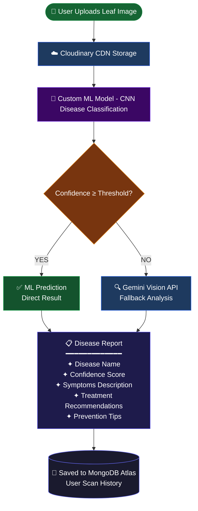
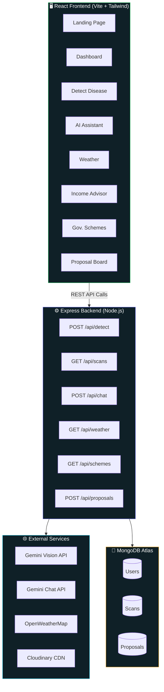

<div align="center">


<br/>


<br/>

<p>
  
  
  
  
  
</p>

<p>
  <a href="https://crop-disease-seven.vercel.app/" target="_blank">
    
  </a>
  &nbsp;
  <a href="https://github.com/nmanoj10/crop-disease/stargazers">
    
  </a>
  &nbsp;
  <a href="https://github.com/nmanoj10/crop-disease/issues">
    
  </a>
</p>

<br/>


<br/>

> ### *Empowering farmers with AI — detect diseases, forecast risks, and grow smarter.*

<br/>

</div>

---

## 🌱 What is AgroVision?

**AgroVision** is a full-stack AI-powered smart agriculture platform that helps farmers detect crop diseases early, monitor weather risks, and improve farm productivity using machine learning and intelligent tools.

The platform provides a **complete digital ecosystem** for modern agriculture, integrating:

- 🔬 Real-time crop disease detection via custom ML + Gemini Vision fallback
- 🤖 Conversational AI farming advisor powered by Google Gemini
- 🌦 Live weather forecasting with crop disease risk scoring
- 💰 Data-driven crop profitability analysis and recommendations
- 🏛 Government agricultural scheme discovery and eligibility guide
- 💡 Community-driven farming innovation and proposal board

```
📸 Upload a leaf image  →  🧠 AI detects the disease  →  💊 Get treatment in seconds
```

> No expertise required. No complicated setup. Just point, scan, and grow.

---

## 📸 Platform Screenshots

<div align="center">

<table>
  <tr>
    <td align="center" width="50%">
      
      <br/><br/><b>🏠 Landing Page</b>
    </td>
    <td align="center" width="50%">
      
      <br/><br/><b>🌿 Disease Detection</b>
    </td>
  </tr>
  <tr>
    <td align="center" width="50%">
      
      <br/><br/><b>🤖 AI Agricultural Assistant</b>
    </td>
    <td align="center" width="50%">
      
      <br/><br/><b>🌦 Weather & Risk Analysis</b>
    </td>
  </tr>
  <tr>
    <td align="center" width="50%">
      
      <br/><br/><b>💰 Income & Crop Advisor</b>
    </td>
    <td align="center" width="50%">
      
      <br/><br/><b>🏛 Government Schemes</b>
    </td>
  </tr>
  <tr>
    <td align="center" width="50%">
      
      <br/><br/><b>💡 Community Innovation Board</b>
    </td>
    <td align="center" width="50%">
      
      <br/><br/><b>📊 User Dashboard</b>
    </td>
  </tr>
</table>

</div>

---

## ✨ Core Features

<div align="center">

| Module | Capability | Powered By |
|:---:|---|:---:|
| 🌿 **Disease Detection** | Upload leaf → instant AI diagnosis with full treatment plan | ML Model + Gemini Vision |
| 🤖 **AI Assistant** | 24/7 farming chatbot for pesticide, fertilizer & crop advice | Google Gemini AI |
| 🌦 **Weather & Risk** | 7-day forecast + disease outbreak probability alerts | OpenWeatherMap API |
| 💰 **Income Advisor** | Profit calculator, crop recommender, seasonal yield insights | Data Analytics |
| 🏛 **Gov. Schemes** | PM-KISAN, PMFBY, Kisan Credit Card, irrigation subsidies | Curated Database |
| 💡 **Innovation Board** | Submit, vote, and discover community farming ideas | MongoDB + React |

</div>

<br/>

### 🌿 AI Crop Disease Detection

> Upload any crop leaf image — get a precise diagnosis instantly.

- **Drag-and-drop** or camera capture on any device
- Custom-trained **CNN model** identifies diseases with high accuracy
- **Gemini Vision fallback** auto-activates when ML confidence is below threshold
- Returns: disease name, confidence score, symptoms, treatment plan, and prevention tips
- Every scan is saved to your **personal history dashboard**

### 🤖 AI Agricultural Assistant

> Your personal farming expert — available 24/7.

- Ask anything: disease ID, pesticide selection, fertilizer ratios, irrigation timing
- **Context-aware** responses based on your local weather and current season
- Best practices for soil health, crop rotation, and integrated pest management
- Clean conversational interface powered by **Google Gemini**

### 🌦 Weather & Disease Risk Engine

> Know the threat before it reaches your field.

- Real-time conditions from **OpenWeatherMap**
- Full **7-day forecast** with farming impact analysis per day
- AI-generated **disease risk scores** based on humidity, temperature, and dew point
- Region-specific recommendations to prevent disease outbreaks before they start

### 💰 Income & Crop Recommendation Advisor

> Plant smarter. Earn more. Waste less.

| Tool | What It Does |
|---|---|
| 📊 Profit Calculator | Estimate crop ROI before planting season |
| 🌾 Crop Recommender | AI picks the best crops for your land & local climate |
| 📈 Yield Insights | Compare seasonal yield projections side-by-side |
| 💧 Water Planner | Smart irrigation requirements calculated per crop type |
| 🏆 High-Yield Rankings | Top-performing crops ranked specifically for your region |

### 🏛 Government Scheme Explorer

> Never miss a subsidy or support program again.

- 🌾 **PM-KISAN** — ₹6,000/year direct income support for eligible farmers
- 🛡 **PMFBY** — Pradhan Mantri Fasal Bima Yojana crop insurance coverage
- 💳 **Kisan Credit Card** — Agricultural credit at just 4% interest per annum
- 💧 **Irrigation Subsidies** — Funding for water infrastructure development
- 🌱 **Organic Farming Support** — Financial incentives to go chemical-free

### 💡 Community Innovation Board

> Farmers helping farmers — share what works.

- Submit innovative farming solutions, hacks, or techniques
- Browse and discover ideas shared by the agri-community
- Receive feedback and endorsements from agricultural experts
- Vote on proposals to help surface the most impactful ideas

---

## 🔁 Disease Detection Workflow



---

## 🏗 System Architecture



---

## 🧠 Tech Stack

<div align="center">

**Frontend**


**Backend**


**AI & Machine Learning**


**External APIs & Hosting**


</div>

---

## 📂 Project Structure

```
agrovision/
│
├── 📁 client/                           # React Frontend (Vite)
│   ├── 📁 public/
│   └── 📁 src/
│       ├── 📁 components/
│       │   ├── Navbar.jsx
│       │   ├── Sidebar.jsx
│       │   ├── DiseaseCard.jsx
│       │   ├── WeatherWidget.jsx
│       │   └── ChatInterface.jsx
│       ├── 📁 pages/
│       │   ├── LandingPage.jsx          # Platform intro & features
│       │   ├── Dashboard.jsx            # Scan stats & history
│       │   ├── DetectDisease.jsx        # Image upload & AI analysis
│       │   ├── AIAssistant.jsx          # Gemini chatbot interface
│       │   ├── Weather.jsx              # Forecast & risk alerts
│       │   ├── IncomeAdvisor.jsx        # Profitability tools
│       │   ├── Schemes.jsx              # Government scheme explorer
│       │   └── ProposalBoard.jsx        # Community innovations
│       ├── 📁 services/
│       │   ├── api.js                   # Axios instance + interceptors
│       │   └── auth.js                  # Token management
│       ├── App.jsx
│       └── main.jsx
│
├── 📁 server/                           # Express Backend
│   ├── 📁 controllers/
│   │   ├── detectController.js          # ML + Gemini detection logic
│   │   ├── chatController.js            # AI assistant handler
│   │   ├── weatherController.js         # OpenWeatherMap integration
│   │   └── schemeController.js          # Gov schemes data
│   ├── 📁 models/
│   │   ├── User.js                      # Mongoose user schema
│   │   ├── Scan.js                      # Disease scan history
│   │   └── Proposal.js                  # Community proposals
│   ├── 📁 routes/
│   │   ├── detect.js
│   │   ├── auth.js
│   │   ├── weather.js
│   │   └── proposals.js
│   ├── 📁 middleware/
│   │   ├── auth.js                      # JWT verification middleware
│   │   └── upload.js                    # Multer + Cloudinary handler
│   └── server.js                        # Application entry point
│
├── .env.example
├── package.json
└── README.md
```

---

## ⚡ Quick Start

### Prerequisites

| Tool | Min Version | Download |
|---|:---:|---|
| Node.js | v18+ | [nodejs.org](https://nodejs.org/) |
| npm | v9+ | Bundled with Node.js |
| Git | Latest | [git-scm.com](https://git-scm.com/) |

### Step 1 — Clone the Repository

```bash
git clone https://github.com/nmanoj10/crop-disease.git
cd crop-disease
```

### Step 2 — Install Dependencies

```bash
npm install
```

### Step 3 — Set Up Environment Variables

```bash
cp .env.example .env
```

Open `.env` and fill in your credentials:

```env
# ── Server ─────────────────────────────────────────────
NODE_ENV=development
PORT=3001
FRONTEND_URL=http://localhost:5173

# ── Database ───────────────────────────────────────────
MONGODB_URI=mongodb+srv://<user>:<password>@cluster0.xxxxx.mongodb.net/agrovision

# ── Authentication ─────────────────────────────────────
JWT_ACCESS_SECRET=your_jwt_access_secret_min_32_chars
JWT_REFRESH_SECRET=your_jwt_refresh_secret_min_32_chars

# ── AI Services ────────────────────────────────────────
GEMINI_API_KEY=AIzaSy_your_gemini_api_key_here

# ── Weather API ────────────────────────────────────────
OPENWEATHER_API_KEY=your_openweathermap_api_key

# ── Image Storage (Cloudinary) ─────────────────────────
CLOUDINARY_CLOUD_NAME=your_cloudinary_cloud_name
CLOUDINARY_API_KEY=your_cloudinary_api_key
CLOUDINARY_API_SECRET=your_cloudinary_api_secret
```

<details>
<summary><b>📋 Where to get each API key — click to expand</b></summary>

<br/>

| Variable | Service | How to Get |
|---|---|---|
| `MONGODB_URI` | MongoDB Atlas | [cloud.mongodb.com](https://cloud.mongodb.com) → New Project → Free M0 Cluster → Connect |
| `GEMINI_API_KEY` | Google AI Studio | [aistudio.google.com](https://aistudio.google.com) → Get API Key → Create API Key |
| `OPENWEATHER_API_KEY` | OpenWeatherMap | [openweathermap.org/api](https://openweathermap.org/api) → Sign up → Free tier key |
| `CLOUDINARY_*` | Cloudinary | [cloudinary.com](https://cloudinary.com) → Dashboard → API Keys section |
| `JWT_*_SECRET` | — | Run: `node -e "console.log(require('crypto').randomBytes(32).toString('hex'))"` |

</details>

### Step 4 — Run the Application

```bash
# Terminal 1 — Start backend server
npm run server

# Terminal 2 — Start frontend dev server
npm run dev
```

Open your browser:

```
http://localhost:5173
```

---

## 🔌 API Reference

### Health Check

```http
GET /api/health
```

```json
{ "status": "ok", "timestamp": "2025-03-13T18:30:00.000Z" }
```

---

### Detect Disease

```http
POST /api/detect
Content-Type: multipart/form-data
```

| Field | Type | Required | Description |
|---|---|:---:|---|
| `image` | `File` | ✅ | Crop leaf image (JPG, PNG, WEBP) |

**Response:**

```json
{
  "success": true,
  "disease": "Tomato Late Blight",
  "confidence": 0.94,
  "source": "ml_model",
  "symptoms": [
    "Dark brown water-soaked lesions on leaves",
    "White fuzzy mold visible on leaf undersides"
  ],
  "treatment": [
    "Apply copper-based fungicide immediately",
    "Remove and destroy all infected plant material"
  ],
  "imageUrl": "https://res.cloudinary.com/agrovision/..."
}
```

---

### Get Scan History

```http
GET /api/scans
Authorization: Bearer <access_token>
```

```json
{
  "total": 12,
  "scans": [
    {
      "_id": "64abc123...",
      "disease": "Tomato Late Blight",
      "confidence": 0.94,
      "imageUrl": "https://res.cloudinary.com/...",
      "createdAt": "2025-03-13T18:30:00.000Z"
    }
  ]
}
```

---

### AI Chat Assistant

```http
POST /api/chat
Content-Type: application/json
Authorization: Bearer <access_token>

{ "message": "What fungicide should I use for powdery mildew on wheat?" }
```

---

### Weather + Risk Score

```http
GET /api/weather?lat=28.6139&lon=77.2090
```

```json
{
  "current": { "temp": 28, "humidity": 78, "description": "Partly cloudy" },
  "riskScore": 72,
  "riskLevel": "HIGH",
  "alert": "High humidity may trigger fungal outbreaks. Apply preventive fungicide today."
}
```

---

## 📊 Platform Modules

<div align="center">

| # | Module | Route | Description |
|:---:|---|---|---|
| 1 | 🏠 Landing Page | `/` | Platform intro, features, and call-to-action |
| 2 | 📊 Dashboard | `/dashboard` | Scan statistics and recent activity feed |
| 3 | 🌿 Disease Detect | `/detect` | Upload leaf → instant AI diagnosis |
| 4 | 🤖 AI Assistant | `/assistant` | Gemini-powered farming chatbot |
| 5 | 🌦 Weather | `/weather` | Forecast and crop disease risk analysis |
| 6 | 💰 Income Advisor | `/income` | Crop profitability calculator and recommender |
| 7 | 🏛 Gov. Schemes | `/schemes` | Agricultural scheme explorer |
| 8 | 💡 Proposal Board | `/proposals` | Community farming innovation platform |

</div>

---

## 🎯 Who Is AgroVision For?

```
🌾  Small & Marginal Farmers    →  Expert-level disease diagnosis, completely free
📚  Agriculture Students        →  Learn plant pathology with real AI feedback
🏢  AgriTech Startups           →  Integrate the detection API into your product
🔬  Research Institutions       →  Build and expand labeled crop disease datasets
🌐  Smart Farming Systems       →  Combine with IoT sensors for predictive alerts
🌍  NGOs & Government Bodies    →  Scale farmer advisory services at low cost
```

---

## 🔮 Roadmap

<div align="center">

| Status | Feature |
|:---:|---|
| 🔜 | 📱 Native mobile app (React Native) for offline-capable farms |
| 🔜 | 🛸 Drone crop scanning for field-scale disease mapping |
| 🔜 | 🛰 Satellite NDVI monitoring for large-scale crop health |
| 🔜 | 🧪 Soil sensor integration — NPK + pH-based recommendations |
| 🔜 | 🗣 Multilingual voice assistant (Hindi, Tamil, Telugu, Marathi) |
| 🔜 | 📡 SMS disease risk alerts — no internet connection required |
| 🔜 | 🤝 Peer-to-peer marketplace for farmers to buy/sell produce |
| 🔜 | 🌍 Multi-region localized crop database expansion |

</div>

---

## 🤝 Contributing

Contributions make the open-source community extraordinary. All contributions are **warmly welcomed!**

```bash
# 1. Fork this repository via the GitHub UI

# 2. Clone your fork locally
git clone https://github.com/YOUR_USERNAME/crop-disease.git
cd crop-disease

# 3. Create a descriptive feature branch
git checkout -b feature/your-amazing-feature

# 4. Make your changes and commit with a clear message
git add .
git commit -m "feat: add your amazing feature"

# 5. Push to your fork
git push origin feature/your-amazing-feature

# 6. Open a Pull Request on GitHub
```

### 📝 Commit Message Convention

| Prefix | Use For |
|---|---|
| `feat:` | New feature |
| `fix:` | Bug fix |
| `docs:` | Documentation changes only |
| `style:` | Formatting — no logic changes |
| `refactor:` | Code restructure, no feature change |
| `perf:` | Performance improvements |
| `test:` | Adding or updating tests |
| `chore:` | Build process or tooling changes |

---

## 📄 License

Distributed under the **MIT License**. See [`LICENSE`](./LICENSE) for complete terms.

```
MIT License — Copyright (c) 2025 Manoj N
Free to use, modify, and distribute with attribution.
```

---

## 👨‍💻 Author

<div align="center">

<br/>

### Manoj N

*Full-Stack Developer · AI Enthusiast · AgriTech Builder*

<br/>

[](https://github.com/nmanoj10)
&nbsp;&nbsp;
[](https://crop-disease-seven.vercel.app/)

<br/>

</div>

---

<div align="center">


<br/>

**Built with 🌱 love — for every farmer working hard in the field**

*If AgroVision helped or inspired you, please give it a* ⭐ *on GitHub — it truly means everything!*

<br/>


</div>
